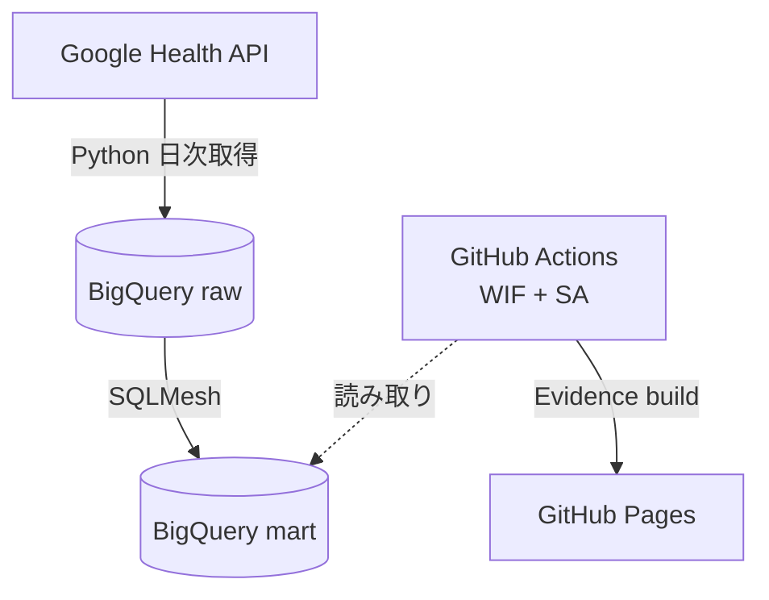

# pluse-board

Google Health API で取得した健康データ（運動・歩数・アクティブゾーン分）を、BigQuery → SQLMesh → Evidence → GitHub Pages で可視化するダッシュボード。

> **プロジェクト名について**
> `pluse` は **plus**（健康にプラス）と **pulse**（健康の鼓動・脈動）を組み合わせた造語です。typo ではなく意図的な綴りです。

## アーキテクチャ



---

## 事前準備（手動作業）

以下の手順を順番に実施してください。コードの実装はこれらが完了していることを前提としています。

### 1. GCP プロジェクト準備

```bash
# プロジェクト作成（既存を使う場合はスキップ）
gcloud projects create YOUR_PROJECT_ID --name="pluse-board"
gcloud config set project YOUR_PROJECT_ID

# 必要な API を有効化
gcloud services enable \
  health.googleapis.com \
  bigquery.googleapis.com \
  iam.googleapis.com \
  iamcredentials.googleapis.com
```

### 2. BigQuery データセット作成

```bash
bq mk --location=asia-northeast1 YOUR_PROJECT_ID:fitbit_raw
bq mk --location=asia-northeast1 YOUR_PROJECT_ID:fitbit_mart
```

### 3. OAuth 2.0 クライアント作成と refresh token 取得

1. [Google Cloud Console](https://console.cloud.google.com/apis/credentials) で OAuth 2.0 クライアント ID を作成
   - アプリケーションの種類: **デスクトップ アプリ**
   - リダイレクト URI: `http://localhost:8080/callback`
2. クライアント ID とクライアントシークレットをメモ
3. 以下のスクリプトで refresh token を取得:

```bash
uv sync --only-group ingest
uv run python ingest/oauth_bootstrap.py \
  --client-id YOUR_CLIENT_ID \
  --client-secret YOUR_CLIENT_SECRET
# ブラウザが開くので認可 → refresh token が表示される
```

4. 表示された refresh token をメモ（GitHub Secrets に登録します）

### 4. Workload Identity Federation セットアップ

```bash
export PROJECT_ID=YOUR_PROJECT_ID
export PROJECT_NUMBER=$(gcloud projects describe $PROJECT_ID --format='value(projectNumber)')
export REPO=YOUR_GITHUB_USERNAME/pluse-board
export SA=fitbit-dashboard@${PROJECT_ID}.iam.gserviceaccount.com

# Service Account 作成
gcloud iam service-accounts create fitbit-dashboard \
  --display-name="pluse-board CI"

# BigQuery 権限付与
# dataOwner が必要: SQLMesh の janitor が期限切れ仮想環境の dataset を削除するため
# (dataEditor には bigquery.datasets.delete が含まれない)
gcloud projects add-iam-policy-binding ${PROJECT_ID} \
  --member="serviceAccount:${SA}" --role="roles/bigquery.dataOwner"
gcloud projects add-iam-policy-binding ${PROJECT_ID} \
  --member="serviceAccount:${SA}" --role="roles/bigquery.jobUser"

# Workload Identity Pool 作成
gcloud iam workload-identity-pools create github-pool \
  --location=global \
  --display-name="GitHub Actions Pool"

# GitHub OIDC Provider 作成
gcloud iam workload-identity-pools providers create-oidc github \
  --location=global \
  --workload-identity-pool=github-pool \
  --issuer-uri="https://token.actions.githubusercontent.com" \
  --attribute-mapping="google.subject=assertion.sub,attribute.repository=assertion.repository" \
  --attribute-condition="assertion.repository=='${REPO}'"

# SA にリポジトリからの借用を許可
gcloud iam service-accounts add-iam-policy-binding ${SA} \
  --role="roles/iam.workloadIdentityUser" \
  --member="principalSet://iam.googleapis.com/projects/${PROJECT_NUMBER}/locations/global/workloadIdentityPools/github-pool/attribute.repository/${REPO}"
```

### 5. GitHub Secrets / Variables 登録

リポジトリの **Settings → Secrets and variables → Actions** で以下を登録:

#### Secrets（機密情報）

| 名前 | 値 |
|---|---|
| `GOOGLE_HEALTH_CLIENT_ID` | OAuth クライアント ID |
| `GOOGLE_HEALTH_CLIENT_SECRET` | OAuth クライアントシークレット |
| `GOOGLE_HEALTH_REFRESH_TOKEN` | 手順 3 で取得した refresh token |
| `SQLMESH_STATE_HOST` | SQLMesh state 用 Postgres のホスト（手順 7 の Neon） |
| `SQLMESH_STATE_USER` | 同 ユーザー |
| `SQLMESH_STATE_PASSWORD` | 同 パスワード |

#### Variables（非機密の設定値）

| 名前 | 値 |
|---|---|
| `PROJECT_ID` | GCP プロジェクト ID（例: `my-project-123`） |
| `PROJECT_NUMBER` | GCP プロジェクト番号（数字のみ） |
| `BQ_DATASET_RAW` | raw データセット名（既定: `fitbit_raw`） |
| `BQ_DATASET_MART` | mart データセット名（既定: `fitbit_mart`） |
| `BQ_LOCATION` | BigQuery ロケーション（例: `asia-northeast1`） |

### 6. GitHub Pages 有効化

リポジトリの **Settings → Pages** で:
- Source: **GitHub Actions** を選択

> **注意**: 健康データを含むため、リポジトリは **Private** に設定してください（GitHub Pages は Pro プラン以上で Private リポジトリにも対応）。

### 7. SQLMesh state backend（Neon Postgres）準備

SQLMesh は snapshot/environment の状態を永続化する必要があり、ephemeral な CI でも参照できる外部 DB を使う（BigQuery 自体を state に使うのは非推奨）。無料枠で十分なので [Neon](https://neon.tech) を使う。

1. Neon でプロジェクトを作成し、`sqlmesh` という名前の database を用意（既定 DB をそのまま使う場合は config の `SQLMESH_STATE_DB` で名前を合わせる）
2. 接続情報（host / user / password）を控える
3. 手順 5 の Secrets に `SQLMESH_STATE_HOST` / `SQLMESH_STATE_USER` / `SQLMESH_STATE_PASSWORD` として登録
4. ローカルでも同じ環境変数を `.env` / direnv 等で設定（`sqlmesh_project/config.yaml` が参照）

> GCP に寄せたい場合は Cloud SQL (Postgres) でも可。その場合は接続情報を上記 secrets に入れ替えるだけで、モデルや CI の変更は不要。

---

## ローカル開発

### ingest 動作確認

```bash
# リポジトリルートで実行
uv sync --only-group ingest

# exercise データを取得して BigQuery にロード
uv run python ingest/pull_health_api.py --data-type exercise --start 2026-04-01

# 既定では JST 今日を end（exclusive）として直近 3 日分を再取得する
uv run python ingest/pull_health_api.py

# 最新の完了日（既定: JST 昨日）が raw に入っているか確認する
uv run python ingest/check_health_data_freshness.py
```

### SQLMesh 動作確認

ローカルは既定 gateway（`bigquery`）を使い、state はローカルの DuckDB ファイル（`sqlmesh_state.db`）に保存される。外部 DB は不要で、**必要なのは BigQuery 認証だけ**:

```bash
gcloud auth application-default login

# リポジトリルートで実行
uv sync --only-group sqlmesh
cd sqlmesh_project

# raw テーブルの外部モデル定義を実テーブルから再生成（初回のみ）
uv run sqlmesh create_external_models

# dev 仮想環境にモデルを構築（dialect エラーはここで検出）。state はローカル DuckDB。
uv run sqlmesh plan dev

# audits（not_null / unique_values）の実行
uv run sqlmesh audit
```

本番(prod)への反映は **state を一本化するため必ず CI gateway（Neon）経由**で行う。ローカルから手動で打つ場合も `--gateway ci` を使い、手順 7 の `SQLMESH_STATE_*` を設定しておく:

```bash
uv run sqlmesh --gateway ci plan        # fitbit_mart.mart_* ビューを公開
```

> **dbt とのパリティ確認**: dbt は `fitbit_mart.mart_*`、SQLMesh dev は `fitbit_mart__dev.mart_*` に出力される。dbt は SQLMesh の管理環境ではないので、BigQuery で双方向 `EXCEPT DISTINCT` の件数が 0 かを見る（下記）。SQLMesh 同士（例: cutover 後の prod ⇔ dev）の比較は `uv run sqlmesh table_diff prod:dev '<model>'` が使える。
>
> ```sql
> -- 0 ならパリティOK（例: mart_steps_daily。PROJECT_ID は実値に置換）
> SELECT COUNT(*) AS diff_rows FROM (
>   (SELECT * FROM `PROJECT_ID.fitbit_mart.mart_steps_daily`
>    EXCEPT DISTINCT
>    SELECT * FROM `PROJECT_ID.fitbit_mart__dev.mart_steps_daily`)
>   UNION ALL
>   (SELECT * FROM `PROJECT_ID.fitbit_mart__dev.mart_steps_daily`
>    EXCEPT DISTINCT
>    SELECT * FROM `PROJECT_ID.fitbit_mart.mart_steps_daily`)
> );
> ```

#### マルチユーザー運用メモ

ローカルの state は `sqlmesh_state.db`（DuckDB ファイル、gitignore 済み）で、**マシンローカルなキャッシュ的状態**。同じマシンでは永続化されるので `dev` は毎回作り直されず差分のみ backfill される（消す/別マシンで clone したときだけ再構築）。state DB をコミットしないのは正しい（バイナリ衝突や他人の fingerprint 混入を避けるため）。

ただし**複数人で開発する場合**、衝突するのは state ファイル（各自別物）ではなく、BigQuery 上で共有される **`dev` という環境名**（`fitbit_mart__dev` のビューを取り合う）。チーム運用では:

- **開発者ごとに環境を分ける**: `uv run sqlmesh plan dev_$USER` → `fitbit_mart__dev_<name>` に隔離される。仮想環境はビューだけなので安価。
- **state backend を共有する**（ローカルでも `--gateway ci` の Neon を使う）と、prod の物理テーブルを fingerprint で再利用してゼロコピーで環境を作れる（SQLMesh の本領）。ローカル throwaway state ではこの恩恵は得られない。
- dev 環境は既定 TTL（約1週間）で自動失効し、`sqlmesh run` 内蔵の `janitor` が期限切れ環境と未参照の物理テーブルを掃除する。

> 本リポジトリは単一ユーザー前提なので、当面は既定 gateway（ローカル DuckDB state）＋ `dev` のままで問題ない。チーム化・本格運用時に上記へ移行する。

### Evidence 動作確認

```bash
cd reports
npm install
npm run sources   # BigQuery からデータを取得
npm run dev       # http://localhost:3000/pluse-board
```

### GitHub Actions workflow lint

```bash
./scripts/actionlint
```

この wrapper は、ローカルに `actionlint` があればそれを使います。なければ Docker、さらに Docker もなければ Go toolchain で、このリポジトリで pin した actionlint を実行します。

---

## データフロー

| レイヤー | BigQuery データセット | 内容 |
|---|---|---|
| raw | `fitbit_raw` | Health API から取得したデータをそのまま格納 |
| mart | `fitbit_mart` | SQLMesh で集計・変換したレポート用テーブル |

### raw テーブル

| テーブル | データタイプ | 説明 |
|---|---|---|
| `exercise` | `exercise` | 運動セッション（種別・時間） |
| `steps` | `steps` | 歩数 |
| `active_zone_minutes` | `active-zone-minutes` | アクティブゾーン分（ACWR 計算に使用） |

### mart テーブル

| テーブル | 説明 |
|---|---|
| `mart_exercise_daily` | 日次運動時間（種別ごと） |
| `mart_exercise_weekly` | 週次運動時間（種別ごと） |
| `mart_steps_daily` | 日次歩数 |
| `mart_load_daily` | 日次トレーニング負荷（AZM 合計） |
| `mart_acwr` | ACWR（Acute:Chronic Workload Ratio） |
