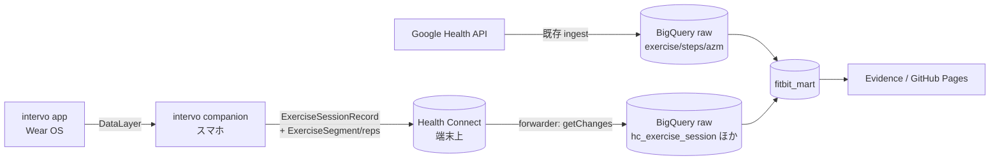

# intervo トレーニングデータ連携 — 設計

> **改訂 (sc-27 レビュー反映)**: 当初案の AT Protocol / PDS 経由は intervo 側で**削除予定**のため撤回。
> 連携ハブを **Health Connect** に置き直す（intervo issue
> [#11](https://github.com/marufeuille/intervo/issues/11)「Health Connect → BigQuery 読み取りパイプライン」の方針に沿う）。

## Context / 課題

現状 pluse-board のトレーニング可視化（`筋トレ` カテゴリ・`mart_strength_*`）は
**Google Health API の `exercise` セッション**を唯一のソースにしている。ここから取れるのは
セッション単位の粒度だけ（`exerciseType`・時間・`caloriesKcal`・`activeZoneMinutes`・`steps`）。
つまり「筋トレを 45 分・週 3 回」までは分かるが、
**「スクワット 12 回 × 3 セット」のような種目・セット粒度は取得できない**。
その粒度は別アプリ [intervo](https://github.com/marufeuille/intervo)（Wear OS インターバルタイマー）が
実測して持っている。

### やりたいこと（sc-27）

1. **Daily**: その日どんなトレーニングをしたかを種目・セット粒度で一覧する
   （「筋トレ」ではなく「スクワット yy 回 × xx セット」）。
2. **Weekly レポート**: 週次でまとめる（何曜日にやったか、内訳、強度など）。

### 制約

- **intervo は公開アプリ**。連携は**疎結合**にする。pluse-board 側の都合で intervo の内部 DB・
  非公開 API に依存してはならない。連携の契約は**標準の外部インターフェース**に限定する。

---

## intervo の出力の変遷（連携面の調査結果）

intervo の companion（スマホ）アプリの外部出力は次のように変遷している:

| 時期 | 出力先 | 状態 |
|---|---|---|
| 〜#44 | 独自 BigQuery / Firebase Functions 同期 | **撤去済み**（#44 でローカル保存＋Health Connect のみに集約） |
| #48〜#60 | PDS / AT Protocol（`dev.marufeuille.workout.*`） | **削除予定**（本改訂の前提。連携基盤には使わない） |
| 現行・継続 | **Health Connect**（`ExerciseSessionRecord` + `HeartRateRecord`） | **継続**。連携ハブに採用 |

そして intervo 側には長期方針として issue
[#11](https://github.com/marufeuille/intervo/issues/11) が既に立っている:

> Health Connect をハブに、HC の生データを BigQuery へ取り込む **ELT** パイプライン。**別リポジトリ**で
> 進める想定。reader は独立した forwarder（HC read + WorkManager + `getChanges`）。raw に
> `dataOrigin.packageName` / recordId / `clientRecordId` / `lastModifiedTime` を保持し自然キーで冪等 MERGE。

本設計はこの #11 の方針に沿って、**Health Connect を唯一の連携契約**にする。

### 現行の Health Connect 書き込みの粒度（`companion/health/HealthConnectWriter.kt`）

- `ExerciseSessionRecord`: 種別（`EXERCISE_TYPE_*`）・開始/終了・`notes = ワークアウト名`・
  `Metadata.activelyRecorded(clientRecordId = "session_<id>")`。
- `HeartRateRecord`: 心拍サンプル。
- **セッション単位のみ。種目別・セット別（reps）は書いていない**。

→ 要件の「スクワット 12×3」を Health Connect 経由で得るには、
**intervo 側で HC 書き込みにセット粒度を足す加算的改修が必要**（下記「intervo 側の最小改修」）。

---

## 採用アーキテクチャ: Health Connect ハブ

契約は **Health Connect のデータモデル（標準の公開 Android API）**。intervo は「HC に標準レコードを
書く」だけ、pluse-board（または forwarder）は「HC 由来の raw を読む」だけで、両者はコード上独立する。

### consumption の 2 経路（どちらを採るかは要確認）

| 経路 | 概要 | コスト | 粒度 | 判定 |
|---|---|---|---|---|
| **経路1: 既存 Google Health API で足りるか検証** | HC に書いた exercise セッション/セグメントが Google Health API v4 のレスポンスに現れるなら、既存 `pull_health_api.py` + `stg_exercise` の拡張だけで済む | 低 | 要検証（v4 が segment/reps を返すか不明） | **まず検証** |
| **経路2: Health Connect → BQ forwarder（#11）** | HC を直接読む独立 Android forwarder（`getChanges`＋WorkManager）で raw へ MERGE。pluse-board はその raw を消費 | 高（別 repo・HC 権限・Play 審査） | ◎（segment/reps をそのまま着地） | 経路1が粒度不足なら採用 |

- **経路1** が使えれば最小構成。Google Health API が Health Connect のセグメント/回数を露出するかを
  実データで 1 度確認するのが最初のタスク（`fitbit_raw.exercise` の JSON に `segment`/`repetitions`
  相当が来るか）。
- **経路2** は intervo issue #11 そのもの。forwarder は「汎用 HC→raw ELT」で intervo 専用にしない
  （`dataOrigin.packageName` で intervo 由来を絞る）。別 repo 化が #11 の想定。pluse-board は
  raw データセットを契約として消費するだけにする。

---

## intervo 側の最小改修（別 PR・別リポ・加算的）

要件（種目・セット粒度）を満たす唯一の必須改修。既存の HC 書き込みに**セット粒度を加算**する。

- `HealthConnectWriter.write` の `ExerciseSessionRecord` に **`segments: List<ExerciseSegment>`** を付与:
  - 各セット/種目を 1 セグメントとして `startTime`/`endTime`/`repetitions`（回数）で表現。
  - 既知種目は `ExerciseSegment.EXERCISE_SEGMENT_TYPE_*`（例: squat/deadlift/…）へマッピング。
  - `performedSetsJson`（Wear→companion で既に転送済みのセット単位実績）を素材にできる。
- **オープン論点（種目名の保持）**: `ExerciseSegment` の型は**固定 enum**で、intervo の自由入力の
  種目名（「スクワット」やカスタム名）を完全には表現できない。名前を残す案:
  - (a) `notes` に構造化サマリ（種目名＋セット×レップ）を併記する。
  - (b) 種目名→セグメント型のマッピング表を **pluse-board 側（下流）** に持ち、HC には型と回数だけ書く。
  - → ELT 思想（生データは薄く、名寄せは下流）なら (b) 寄り。要判断。
- 任意: 予定（プラン）を `PlannedExerciseSessionRecord` で書けば「予定 vs 実績」も表現可能。
- **後方互換**: セグメント無しの既存レコードでも session 単位では従来どおり読める。
- 心拍は既存どおり `HeartRateRecord` で書く（PDS 撤去に伴い、心拍の非送信という PDS 固有の制約は消える）。

> この改修が入るまでは、pluse-board 側はセッション単位（既存 `mart_strength_*` 相当）でしか
> 詳細を出せない。Daily 種目一覧はセグメント着地後に実装する。

---

## pluse-board 側の設計

### raw（連携契約）

- 経路1採用時: 既存 `fitbit_raw.exercise` を拡張（JSON に segment が来る前提で staging を追加解釈）。
- 経路2採用時: forwarder が着地する `fitbit_raw.hc_exercise_session`（1 レコード = 1 セッション、
  `raw`(JSON) + `data_origin` + `record_id` + `client_record_id` + `last_modified_time`）。
  セグメントは JSON 内 or 別テーブル `hc_exercise_segment`。冪等 MERGE は自然キー
  (`client_record_id`) で行う。

### Staging（`sqlmesh_project/models/staging/`）

- `stg_training_session`: セッション属性（開始/終了・種別・ワークアウト名・`data_origin`）。
- `stg_training_set`: セグメント（種目/セット）を 1 行に unnest（`exercise_type` or `exercise_name`・
  `set_number`・`reps`・`duration_seconds`）。名前は上記オープン論点の解決方針に従う。

### Marts

| モデル | 粒度 | 主なカラム | 用途 |
|---|---|---|---|
| `mart_training_daily` | 日 × 種目 | `activity_date, exercise, sets, total_reps, reps_detail, duration_minutes` | **Daily 一覧（要件①）** |
| `mart_training_session` | セッション | `session_id, started_at, completed_at, duration_minutes, exercise_count, workout_name` | 週次の母数・曜日 |
| `mart_training_weekly` | 週（日曜始まり） | `week_start, sessions, training_days, dow_breakdown, category_breakdown, total_sets, total_reps, duration_minutes` | **Weekly レポート（要件②）** |

- 週区切りは既存定義（`about.md`）に合わせ **`WEEK(SUNDAY)`**。欠週/休養日の 0 埋めは既存
  `mart_strength_weekly` / `mart_acwr` の calendar JOIN 思想を踏襲。
- **既存 `mart_strength_*` との突合**: 既存（Google Health API 由来：心拍/AZM/カロリー）と
  本 mart（HC 由来：種目/セット明細）を**時間窓で突合**し、
  「詳細（種目）＋強度（AZM/HR）」を 1 セッションに寄せる `mart_training_session_enriched`（応用）。
  ただし経路1（同一 Google Health API 由来）なら二重計上の恐れがあるため `data_origin` で分離する。

### Evidence ページ（`reports/pages/training.md` 新規）

- **Daily 一覧**: 日付選択 → その日の種目テーブル（種目名・セット×レップ・時間）。
- **Weekly レポート**: 週選択 → 曜日別分布・カテゴリ内訳（積み上げ棒）・種目別ボリューム・週次サマリ。
- 指標定義は `about.md` に追記。

---

## 週次トレーニングレポートの「標準的な表現」

「トレーニング報告の標準的な表現」への回答。**intervo で取れるもの/取れないもの**を明示して整理する
（連携ハブが HC に変わっても、intervo が記録する内容自体は同じなので本節は不変）。

| 軸 | 標準指標 | intervo データで可能か |
|---|---|---|
| **頻度 (Frequency)** | 週あたりセッション数・トレーニング日数・曜日分布 | ◎ セッションの完了時刻 |
| **ボリューム (Volume)** | セット数・総レップ数（本来は tonnage = Σ 重量×レップ） | △ セット数・総レップは可。**重量が無いので tonnage 不可** |
| **強度 (Intensity)** | %1RM・RPE が標準 | ✗ 重量/RPE は intervo に無い。**代理指標**として AZM（`mart_load_daily`）・心拍（HC の `HeartRateRecord`）を用いる |
| **密度 (Density)** | 運動時間 / 総時間（work:rest 比） | ○ 運動時間と休憩設定から近似可 |
| **バランス (Balance)** | 部位別（push/pull/legs 等）内訳 | △ 種目名/型はあるが部位マッピングは無い。種目→部位の対応表を下流に持てば実現可（応用） |
| **進捗 (Progression)** | 週次のボリューム/レップ推移 | ◎ 週次 mart で trend 化 |
| **負荷管理** | ACWR（急性:慢性負荷比） | ◎ 既存 `mart_acwr` を流用（AZM ベース） |

**推奨する週次レポート構成:** ①サマリ（セッション数/トレーニング日数/総時間）②曜日分布
③内訳（カテゴリ別・種目別ボリューム）④強度（AZM/心拍の代理指標＋ACWR 帯域）⑤進捗（前週比）。

> **正直な限界**: intervo は「タイマー＋回数」主体で**重量(kg)と RPE を記録しない**ため、
> レジスタンストレーニングで最も標準的な「tonnage」「%1RM」「RPE」は算出できない。強度は
> AZM/心拍の代理指標で表現し、その旨をレポートに明記する。将来 intervo に重量/RPE を足せば拡張可能。

---

## セキュリティ / プライバシー

- pluse-board の GitHub Pages は既定で**公開**（`README` 記載の既知事項）。トレーニング種目名は
  健康データなので、公開したくない場合は Private Pages / 認証付きホスティングが前提。
- 経路2の forwarder は HC の READ 権限（30 日超は `READ_HEALTH_DATA_HISTORY`、
  バックグラウンドは `READ_HEALTH_DATA_IN_BACKGROUND`）が必要で **Play 審査が厳しめ**（#11 記載）。
- 資格情報・トークンはコミットしない。

---

## 未確定事項（要ユーザー確認）

1. **consumption 経路**: まず経路1（既存 Google Health API が HC のセグメント/回数を露出するか）を
   検証してよいか。露出しなければ経路2（HC→BQ forwarder, #11）へ。
2. **forwarder の置き場**: #11 の想定どおり別リポジトリで作るか、pluse-board 内に最小 ingest を置くか。
3. **intervo の HC 改修**: セグメント書き込みをこの一環でやるか（別 Story か）。種目名の保持方針
   （notes 併記 or 下流マッピング）をどうするか。
4. **公開範囲**: training ページを公開 Pages に載せてよいか、別扱いにするか。

段階的な実装単位は [`intervo-integration-stories.md`](./intervo-integration-stories.md) を参照。
