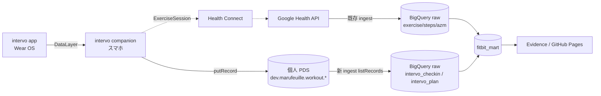

# intervo トレーニングデータ連携 — 設計

## Context / 課題

現状 pluse-board のトレーニング可視化（`筋トレ` カテゴリ・`mart_strength_*`）は
**Google Health API の `exercise` セッション**を唯一のソースにしている。ここから取れるのは
セッション単位の粒度だけ:

- `exerciseType`（`STRENGTH_TRAINING` など）・`activity_name`
- 開始/終了時刻・`activeDuration`・`caloriesKcal`・`activeZoneMinutes`・`steps`

つまり「筋トレを 45 分やった / 週 3 回やった」までは分かるが、
**「スクワット 12 回 × 3 セット」のような種目・セット粒度は取得できない**。
一方その粒度は別アプリ [intervo](https://github.com/marufeuille/intervo)（Wear OS インターバルタイマー）が
実測して持っている。両者は今データとして繋がっていない。

### やりたいこと（sc-27）

1. **Daily**: その日どんなトレーニングをしたかを種目・セット粒度で一覧する
   （「筋トレ」ではなく「スクワット yy 回 × xx セット」）。
2. **Weekly レポート**: 週次でまとめる（何曜日にやったか、内訳、強度など。
   トレーニング報告の標準的な表現に寄せる）。

### 制約

- **intervo は公開アプリ**。連携は**疎結合**にする。pluse-board 側の都合で
  intervo の内部 DB スキーマや非公開 API に依存してはならない。連携の契約は
  **intervo が既に外部公開している出力（AT Protocol lexicon）**に限定する。

---

## intervo 側が既に持っている出力（連携面の調査結果）

intervo は 2 モジュール構成。`app`（Wear）が計測し、`companion`（スマホ）が完了履歴を受け取って
**2 つの外部シンク**へ流している。連携の接点はこの 2 つ:

### A. Health Connect（`companion/health/HealthConnectWriter.kt`）

`ExerciseSessionRecord` + `HeartRateRecord` を書く。**セッション単位のみ**:
種別・開始/終了・`notes=ワークアウト名`・心拍サンプル。**種目/セット粒度は含まれない**。

### B. PDS / AT Protocol（`companion/pds/*`）★連携の本命

App Password 方式で個人の PDS へ XRPC (`com.atproto.repo.putRecord`) で 2 レコードを publish:

| collection (NSID) | 中身 | 粒度 |
|---|---|---|
| `dev.marufeuille.workout.plan` | 再利用されるメニュー定義 | 種目ごとの `planned{sets, reps / durationSeconds, restSeconds}`、`exerciseType` |
| `dev.marufeuille.workout.checkin` | 実施記録（プランを参照） | `startedAt` / `completedAt` / `durationSeconds` / `exerciseCount` / `performed{setCount, completedSetCount}` |

- `source = "intervo"`、`sourceRef` は履歴 ID、checkin は plan を `uri`/`cid` で参照。
- rkey は履歴 ID / workoutId 固定なので**冪等 upsert**。再同期でも重複しない。
- **心拍数は PDS に載せない**（プライバシー方針。1.10.0 リリースノート）。

出典: `companion/pds/WorkoutPdsRecordMapper.kt`, `PdsDirectClient.kt`,
`companion/data/CompanionWorkoutHistory.kt`。

### intervo が実測しているが「まだ PDS に出していない」粒度 ★重要

Wear 側は 1 セットずつの実績を `FreeSetRecord{exerciseName, setNumber, durationSeconds, reps, ...}`
として保持し、`PerformedSetRecordInput` として companion へ転送している
（`companion_workout_history.performedSetsJson`）。
**「スクワット 12 回 × 3 セット」の元データは既に companion 内に存在する**。

ところが現状 checkin の `performed` は `setCount` / `completedSetCount` という**総数の集計のみ**で、
**種目別・セット別の reps は PDS に出ていない**（`WorkoutPdsRecordMapper.performedSummary`）。

→ **要件を満たすには、intervo 側で checkin に「種目別 performed 明細」を足す小改修が 1 つ必要**
（詳細は下の「intervo 側の最小改修」）。これは lexicon への**加算的（後方互換）**な追加で、
公開アプリの外部契約を壊さない。

---

## 連携方式の比較と採用

| 方式 | 疎結合性 | 種目/セット粒度 | 判定 |
|---|---|---|---|
| **PDS (AT Protocol) を pluse-board が read** | ◎ 契約は公開 lexicon のみ。read-only。intervo の DB/API に非依存 | ◎（checkin 明細化後） | **採用** |
| Health Connect → Google Health API 経由 | △ Google 側同期挙動に依存 | ✗ セッション単位のみ。Health Connect の Exercise session に種目/セットは乗らない | 不採用（粒度不足） |
| intervo に pluse-board 向け専用エクスポート/API を作る | ✗ 公開アプリを pluse-board に結合させる | ◎ | 不採用（制約違反） |

**採用: PDS 読み取り方式。** intervo は「個人 PDS にワークアウト記録を publish する」だけ、
pluse-board は「その PDS を read してダッシュボード化する」だけ。両者は AT Protocol lexicon を
唯一の契約として、コード上は完全に独立する。



---

## intervo 側の最小改修（別 PR・別リポ）

要件（種目・セット粒度の Daily 一覧）を満たす唯一の必須改修。**加算的で後方互換**。

- `WorkoutPdsRecordMapper.mapCheckin` の `performed` に、`performedSetsJson` を集約した
  **種目別明細**を追加する。案:

  ```jsonc
  "performed": {
    "setCount": 9,
    "completedSetCount": 9,
    "exercises": [
      { "name": "スクワット", "sets": 3, "reps": [12, 12, 10], "totalReps": 34 },
      { "name": "腕立て伏せ", "sets": 3, "durationSeconds": [40, 40, 35] }
    ]
  }
  ```

- 既存の `setCount`/`completedSetCount` は残す（旧 reader 互換）。`exercises` を**追加**するだけ。
- 心拍は従来どおり PDS に載せない方針を維持（強度は pluse-board 側で AZM 等と突合して補う）。
- テストは `WorkoutPdsRecordMapperTest` にケース追加。
- 既存 checkin（明細なし）も pluse-board 側は total 集計にフォールバックできるよう設計する
  （下記 staging の `exercises` NULL 分岐）。

> この改修が入るまでは、pluse-board 側は checkin の `plan.exercises`（＝**予定**の
> セット/レップ）で Daily 一覧を先行実装できる。「予定」と「実績」は区別して表示する。

---

## pluse-board 側の設計

### 1. Ingest: `ingest/pull_intervo_pds.py`

既存 `pull_health_api.py` と同じ「raw に JSON blob を冪等 upsert」パターンを踏襲する。

- 入力: PDS の `serviceUrl` / `identifier`（handle/DID）。認証は read 方式に応じて:
  - 公開レコードなら `com.atproto.repo.listRecords`（無認証で取得可能な場合あり）。
  - 非公開なら App Password で `createSession` → Bearer（intervo と同じ read-only 資格情報）。
- 取得: `listRecords(repo, collection=dev.marufeuille.workout.checkin, cursor...)` を全ページ取得、
  同様に `...workout.plan` も取得。
- 投入: `fitbit_raw.intervo_checkin` / `fitbit_raw.intervo_plan` に
  `raw`(JSON) + `rkey` + `synced_at` で格納。checkin の `completedAt` 期間で冪等 DELETE→INSERT。
- 資格情報は **GitHub Secrets**（`INTERVO_PDS_SERVICE_URL` / `INTERVO_PDS_IDENTIFIER` /
  `INTERVO_PDS_APP_PASSWORD`）。read 専用の App Password を使う。
- `daily.yml` の Ingest ステップに best-effort で追加（失敗しても既存 Health API ingest は止めない）。
- lineage: 既存 `ingest/lineage.py` の `track_ingest` に合わせて PDS→raw の辺も投入（任意）。

### 2. Staging（`sqlmesh_project/models/staging/`）

- `stg_intervo_checkin`: `JSON_VALUE` で `sourceRef`/`startedAt`/`completedAt`/`durationSeconds`/
  `exerciseCount`/`title`/`planSourceRef` を展開。時刻は `Asia/Tokyo` で日付化。
- `stg_intervo_checkin_exercise`: checkin の `performed.exercises`（明細）を
  `JSON_QUERY_ARRAY` で 1 種目 1 行に unnest。明細が無い旧レコードは plan の `exercises`
  （予定値）にフォールバックし `is_planned=TRUE` を立てる。
- `stg_intervo_plan`: `plan.exercises[]` を 1 種目 1 行に展開（種目名・`exerciseType`・planned sets/reps）。

### 3. Marts

| モデル | 粒度 | 主なカラム | 用途 |
|---|---|---|---|
| `mart_training_daily` | 日 × 種目 | `activity_date, exercise_name, sets, total_reps, reps_detail, duration_minutes, is_planned` | **Daily 一覧（要件①）** |
| `mart_training_session` | セッション | `session_id, started_at, completed_at, duration_minutes, exercise_count, workout_name` | 週次の母数・曜日 |
| `mart_training_weekly` | 週（日曜始まり） | `week_start, sessions, training_days, dow_breakdown, category_breakdown, total_sets, total_reps, duration_minutes` | **Weekly レポート（要件②）** |

- 週の区切りは既存定義（`about.md`）に合わせ **`WEEK(SUNDAY)`**。
- 欠週/休養日の 0 埋めは既存 `mart_strength_weekly` / `mart_acwr` と同じ calendar JOIN 思想を踏襲。
- **既存 `mart_strength_*` との関係**: 既存は Google Health API 由来のセッション（心拍/AZM/カロリー）、
  本 mart は intervo 由来の種目/セット明細。**セッションを時間窓で突合**して
  「同じ筋トレの詳細（intervo）＋強度（AZM/HR: Google Health）」を 1 セッションに寄せる
  `mart_training_session_enriched`（応用）で強度表現を補う。

### 4. Evidence ページ（`reports/pages/training.md` 新規）

- **Daily 一覧**: 日付を選び、その日の種目テーブル（種目名・セット×レップ・時間）を表示。
  予定/実績のバッジ、`is_planned` で色分け。
- **Weekly レポート**: 週選択 → 曜日別ヒートマップ、カテゴリ内訳（積み上げ棒）、
  種目別ボリューム、週次サマリ（下記「標準的な表現」）。
- 既存 `strength.md` / `exercise.md` と相互リンク。指標定義は `about.md` に追記。

---

## 週次トレーニングレポートの「標準的な表現」

「トレーニング報告の標準的な表現」への回答。筋トレ/レジスタンストレーニングで一般的に使う軸を、
**intervo で取れるもの / 取れないもの**を明示して整理する。

| 軸 | 標準指標 | intervo データで可能か |
|---|---|---|
| **頻度 (Frequency)** | 週あたりセッション数・トレーニング日数・曜日分布 | ◎ checkin の completedAt |
| **ボリューム (Volume)** | セット数・総レップ数、（本来は tonnage = Σ 重量×レップ） | △ セット数・総レップは可。**重量が無いので tonnage は不可**（自重/タイマー主体アプリのため） |
| **強度 (Intensity)** | %1RM・RPE が標準 | ✗ 重量/主観強度(RPE)は intervo に無い。**代理指標**として AZM（既存 `mart_load_daily`）・心拍（Google Health 側）を時間窓で突合して用いる |
| **密度 (Density)** | 運動時間 / 総時間（work:rest 比） | ○ durationSeconds と rest 設定から近似可 |
| **バランス (Balance)** | 部位別（push/pull/legs 等）内訳 | △ 種目名・`exerciseType` はあるが**部位マッピングは無い**。種目→部位の対応表を pluse-board 側に持てば実現可（応用） |
| **進捗 (Progression)** | 週次のボリューム/レップ推移 | ◎ 週次 mart で trend 化 |
| **負荷管理** | ACWR（急性:慢性負荷比） | ◎ 既存 `mart_acwr` を流用（AZM ベース） |

**推奨する週次レポートの構成:**

1. **サマリ** — セッション数 / トレーニング日数（例: 週 3 回・4 日）・総トレーニング時間。
2. **曜日分布** — 何曜日にやったか（ヒートマップ or ドット）。
3. **内訳** — カテゴリ別（筋トレ/ウォーキング等）と種目別のボリューム（総レップ・セット数）。
4. **強度** — AZM/心拍ベースの代理強度と ACWR 帯域（緑/赤）。「重量ベースの強度は非対応」を明記。
5. **進捗** — 前週比のボリューム/頻度トレンド。

> **正直な限界**: intervo は「タイマー＋回数」主体で**重量(kg)と主観強度(RPE)を記録しない**ため、
> レジスタンストレーニングで最も標準的な「tonnage」「%1RM」「RPE」は算出できない。
> 強度は AZM/心拍の代理指標で表現し、その旨をレポートに明示する。
> 将来 intervo に重量入力 or RPE を足せば、標準指標にそのまま拡張できる設計にしておく。

---

## セキュリティ / プライバシー

- pluse-board の GitHub Pages は既定で**公開**（`README` 記載の既知事項）。トレーニング種目名は
  健康データなので、公開したくない場合は Private Pages / 認証付きホスティングの検討が前提
  （既存 ACWR 等と同じ扱い）。
- PDS 資格情報は **read 専用の App Password** を GitHub Secrets に置く。ソースにコミットしない。
- intervo 側改修でも**心拍は PDS に載せない**方針を維持する。

---

## 未確定事項（要ユーザー確認）

1. **PDS の所在**: `serviceUrl` / handle（Bluesky 公式 PDS かセルフホストか）。read が無認証で可能か、
   App Password が必要か。
2. **既存 checkin の明細化**: intervo 側改修 PR をこの一環でやるか（別 Story にするか）。
   改修前は「予定値（plan）」で先行実装してよいか。
3. **強度表現の突合**: intervo セッションと Google Health API セッションの重複をどう扱うか
   （時間窓マッチの許容誤差）。
4. **公開範囲**: training ページを既存ダッシュボード（公開 Pages）に載せてよいか、別扱いにするか。

段階的な実装単位は [`intervo-integration-stories.md`](./intervo-integration-stories.md) を参照。
