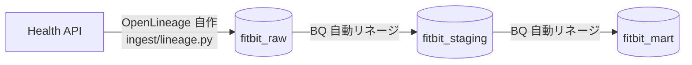

# OpenLineage / Dataplex データリネージ 設計・手順

## Context

pluse-board のデータパイプライン
`Google Health API → ingest(Python) → BigQuery raw → SQLMesh(staging/mart) → Evidence → GitHub Pages`
に対して、**データリネージ（どのデータがどこから来てどこへ行くか）** を可視化する。学習も兼ねて OpenLineage を採用し、GCP ネイティブの **Dataplex（2026/4 以降「Knowledge Catalog」。API 名は不変）** に集約する。

到達したい学び:
1. **OpenLineage 仕様そのもの**（Run / Job / Dataset / Facet）を reference 実装 **Marquez** の UI で体感する。
2. **GCP ガバナンス**として、OpenLineage イベントと BigQuery 自動リネージが Dataplex 上で 1 枚のグラフに統合される様子を見る。

> **Status**: Phase 0（BQ 自動リネージ有効化）・Phase 1（Python 取り込みの OpenLineage 自作）・Phase 2（SQLMesh モデル評価の OpenLineage 計装）は**実装済み・検証済み**（Marquez / Dataplex 両方で確認）。台帳（カスタムエントリ登録）は [`dataplex-governance-stories.md`](dataplex-governance-stories.md) の S4 で回収済み。

## 全体像（3 層のリネージ）

同じパイプラインを 3 通りの方法でリネージ化でき、それぞれ守備範囲が違う:

| 層 | 取得方法 | 実装 | 状態 |
|---|---|---|---|
| BigQuery の SQL 変換（staging→mart） | Data Lineage API 有効化で**テーブル/カラム自動取得** | コード不要 | ✅ Phase 0 |
| Python 取り込み（Health API → `fitbit_raw`） | BQ が見られない API 起点の辺を **OpenLineage 自作**で埋める | `ingest/lineage.py` | ✅ Phase 1 |
| SQLMesh の論理 DAG / 実行統計 | `sqlmesh-openlineage` で START/COMPLETE/FAIL + カラム lineage + 実行統計 | `sqlmesh_project/run_with_lineage.py` | ✅ Phase 2 |



Phase 1 の Dataset 命名を BQ 自動リネージと一致させることで、`API → raw → staging → mart` が**1 本のグラフに地続き**になるのが肝（後述）。

## コスト

- **Dataplex Data Lineage** = premium processing 課金 **$0.089 / DCU-hour・無料枠なし**、metadata ストレージ **$2/GiB・月**（1 MiB 無料）。
- 本プロジェクト規模（16 モデル + 日次数件の ingest イベント）では DCU 消費は極小 → 実質 **月 $0〜数ドル、おそらく $1 未満**。
- **BigQuery のクエリ課金は増えない**（lineage 収集はクエリ課金に載らない）。**Marquez ローカルは無料**（Docker）。
- 無料枠が無いので厳密には $0 ではない → **予算アラート必須**（Phase 0 で先に設定）。
- 「テーブルを細かく何度も更新すると lineage イベントが増える」点に注意。現状の日次 incremental 設計は問題なし。
- 実測は Cloud Billing でラベル `goog-dataplex-workload-type=LINEAGE` の SKU を数日観察して確認する。

---

## Phase 0: BQ ネイティブ lineage の有効化（GCP 設定・コード不要）

「自動で何が取れるか」を体感し、Python で埋めるべき欠落（API→raw の辺）を明確にするフェーズ。

### 1. Data Lineage API 有効化

```bash
gcloud services enable datalineage.googleapis.com --project pluse-board
```

> この 1 つの API が「BigQuery 自動リネージ」と「OpenLineage 受け皿（`processOpenLineageRunEvent`）」の両方を兼ねる。

### 2. IAM

```bash
# 観察用（owner でも明示が確実）
gcloud projects add-iam-policy-binding pluse-board \
  --member="user:marufeuille@gmail.com" --role="roles/datalineage.viewer"
# OpenLineage を emit する側（自分＝ローカル producer）
gcloud projects add-iam-policy-binding pluse-board \
  --member="user:marufeuille@gmail.com" --role="roles/datalineage.editor"
# SQLMesh を実行する CI の SA（自動/カスタム lineage 記録用）
gcloud projects add-iam-policy-binding pluse-board \
  --member="serviceAccount:fitbit-dashboard@pluse-board.iam.gserviceaccount.com" \
  --role="roles/datalineage.editor"
```

### 3. 予算アラート（無料枠が無いので先に張る）

```bash
gcloud services enable billingbudgets.googleapis.com --project pluse-board
# 請求アカウント通貨に合わせる（日本は JPY。USD 指定は INVALID_ARGUMENT になる）
gcloud billing budgets create \
  --billing-account=<BILLING_ACCOUNT_ID> \
  --display-name="pluse-board budget guard" \
  --filter-projects=projects/274885157237 \
  --budget-amount=1000JPY \
  --threshold-rule=percent=0.5 --threshold-rule=percent=0.9 --threshold-rule=percent=1.0
```

> CLI が煩雑ならコンソール（Billing → 予算とアラート）でも可。

### 4. 観察

リネージは **API 有効化“以降”のジョブ**しか記録されない。新しい BQ ジョブを 1 本流して確認する:

```bash
bq query --use_legacy_sql=false --location=asia-northeast1 \
'CREATE OR REPLACE TABLE `pluse-board.fitbit_mart._lineage_demo` AS
 SELECT * FROM `pluse-board.fitbit_mart.mart_load_daily` LIMIT 10'
```

数分後、BigQuery コンソール → `fitbit_mart._lineage_demo` →「リネージ」タブで、元テーブル→demo の辺（**カラム単位まで**）が自動で見える。確認後は掃除:

```bash
bq rm -f -t pluse-board:fitbit_mart._lineage_demo
```

**学び**: テーブル→テーブルは自動で出るが、`Health API → fitbit_raw` の**外部起点の辺は絶対に出ない**。ここを Phase 1 で埋める。

---

## Phase 1: Python 取り込みの OpenLineage 自作

### ローカル Marquez（OpenLineage の“標準の見え方”）

```bash
cd ~/dev && git clone https://github.com/MarquezProject/marquez.git
cd marquez && ./docker/up.sh --api-port 9000 --web-port 3000
```

- API :9000 / Web UI :3000（http://localhost:3000）。
- **API を 9000 にする理由**: macOS は 5000 番を AirPlay Receiver が握るため、既定 :5000 だと競合/403 が起きやすい。
- 疎通確認: `curl -s http://localhost:9000/api/v1/namespaces`

### OpenLineage イベントの構造（学習メモ）

RunEvent はたった 5 要素の組み合わせ:

| フィールド | 意味 | ポイント |
|---|---|---|
| `eventType` | `START`/`RUNNING`/`COMPLETE`/`FAIL`/`ABORT` | 1 回の実行を複数イベントで表す |
| `run.runId` | 実行 1 回を指す UUID | START と COMPLETE を**同じ runId で紐付ける** |
| `job` | 論理的な処理ステップ（namespace + name） | 繰り返し動く処理の identity |
| `inputs`/`outputs` | 消費/生成した **Dataset** | ここが辺（lineage）になる |
| `producer`/`schemaURL` | 誰が/どの仕様で出したか | メタ情報 |

### Dataset 命名規約（最重要）

| ソース種別 | namespace | name | 効果 |
|---|---|---|---|
| BigQuery テーブル | `bigquery` | `project.dataset.table` | **BQ 自動リネージと同じノードに解決**され地続きに |
| 外部ソース（API 等） | `custom` | 任意の参照文字列 | FQN `custom:...` にマップ |

> **Dataplex 固有のクセ**: 外部ソースは `namespace: "custom"` にしないと `INVALID_ARGUMENT: Unrecognized input` で弾かれる（Marquez は緩いので何でも受ける）。本プロジェクトでは Health API を `custom` / `googlehealth:activity/<data_type>` と命名。

### 実装: `ingest/lineage.py`

OpenLineage 送信ヘルパ。**transport は環境変数だけで決まる**（`OpenLineageClient()` が env を読む）ので、モジュールはバックエンド非依存。

- `ingest/pull_health_api.py` の data_type ループを `with track_ingest(...)` で包み、START→COMPLETE（例外時 FAIL）を emit。
- **安全設計**: lineage は「副次情報」。`OPENLINEAGE_URL` 未設定なら完全 no-op、openlineage 未導入や送信失敗でも `::warning::` を出すだけで **ingest 本体は絶対に止めない**。→ CI（`uv sync --only-group ingest`、openlineage 無し）でも壊れない。

環境変数による transport 切替:

```bash
# ローカル Marquez
OPENLINEAGE_URL=http://localhost:9000

# Dataplex（Knowledge Catalog）
OPENLINEAGE_URL=https://datalineage.googleapis.com
OPENLINEAGE_ENDPOINT=v1/projects/pluse-board/locations/asia-northeast1:processOpenLineageRunEvent
OPENLINEAGE_API_KEY=$(gcloud auth print-access-token)   # ADC の Bearer トークン

# 無効化（既定）
# OPENLINEAGE_URL を設定しない、または OPENLINEAGE_DISABLED=true
```

### 検証

```bash
# 依存追加
uv add --group lineage openlineage-python

# ① スモーク（実データ・BQ に触れず emit だけ）→ Marquez
uv run --group lineage python ingest/lineage.py
#   → http://localhost:3000 の pluse-board namespace に ingest.exercise ジョブ

# ② 同じコードで Dataplex（env だけ差し替え）
OPENLINEAGE_URL=https://datalineage.googleapis.com \
OPENLINEAGE_ENDPOINT=v1/projects/pluse-board/locations/asia-northeast1:processOpenLineageRunEvent \
OPENLINEAGE_API_KEY=$(gcloud auth print-access-token) \
uv run --group lineage python ingest/lineage.py
#   → 数分後 BQ コンソール fitbit_raw.exercise のリネージに API 起点の辺

# ③ 実データでエンドツーエンド（Health API OAuth env が必要）
set -a; source .env; set +a
OPENLINEAGE_URL=http://localhost:9000 \
uv run --group ingest --group lineage python ingest/pull_health_api.py --lookback-days 1
```

---

## Phase 2: SQLMesh モデル評価の OpenLineage 計装

BQ 自動リネージは `raw→staging→mart` のテーブル/カラム lineage を自動取得するが、**SQLMesh の実行そのものの provenance**（モデル評価ごとの START/COMPLETE/FAIL・実行統計・`transformations` 付きカラム lineage）は取れない。ここを [`sidequery/sqlmesh-openlineage`](https://github.com/sidequery/sqlmesh-openlineage)（PyPI v0.1.0）で埋める。

### 仕組み

パッケージは SQLMesh の `set_console()` で**グローバル console を差し替える**（`OpenLineageConsole` が全メソッドを委譲しつつ snapshot 評価イベントだけ横取り）。emit 内容:

- **START / COMPLETE / FAIL**（monitor 対象。audit 失敗も FAIL）
- **カラム lineage**（`ColumnLineageDatasetFacet`。`transformations`: DIRECT + IDENTITY|TRANSFORMATION。Dataplex のカラム lineage 要件を満たす）
- **実行統計**（run facet `sqlmesh_execution`: `durationMs`/`rowsProcessed`/`bytesProcessed` ＋ 出力 dataset の `outputStatistics`）
- schema・SQL・ソースコードパス facet

全 emit はパッケージ側で `try/except + warning` の **best-effort**。SQLMesh 0.235.4 の Console API（`update_snapshot_evaluation_progress(execution_stats=...)` 等）と v0.1.0 は互換。

### 採用アプローチ: 案B（config.yaml 温存 + 薄いランナー）

パッケージ README は config.py 必須と書くが、`set_console()` は **`Context.__init__` が `get_console()` で拾う**グローバル状態なので、`Context()` 生成の前に console を差し替える薄いランナーで足りる → **config.yaml を一切変更せず**に計装できる。SQLMesh Bot（`sqlmesh_cicd github run-all`）・ローカル CLI は無影響、lineage は daily の run/plan だけにスコープされる。

実装: **`sqlmesh_project/run_with_lineage.py`**。CLI `sqlmesh --gateway <gw> run|plan` の代替。transport は Phase 1 と同じく**環境変数だけ**で決まり（Marquez / Dataplex を env で切替）、`OPENLINEAGE_URL` 未設定なら素の `Context` 実行に完全フォールバック（no-op 安全）。

### パッケージ標準の install() を使わなかった理由（要対処ギャップ 2 点）

1. **dataset namespace**: `install()` は job と dataset に**同一 namespace**を使う。BQ 自動リネージ / Phase 1 のノード（`namespace="bigquery"`）と地続きにするため、ランナーでは `namespace="bigquery"` で `OpenLineageConsole` を構築する。
2. **Dataplex transport**: パッケージ内の `OpenLineageClient(url=...)` は endpoint が `api/v1/lineage` **固定**で `OPENLINEAGE_ENDPOINT` を**無視**する（Marquez 用。Dataplex の `:processOpenLineageRunEvent` に届かない）。→ ランナーで emitter の client を **env ベースの `OpenLineageClient()`（Phase 1 と同一・`OPENLINEAGE_ENDPOINT` を尊重）に差し替える**。

加えて、**インストール済み v0.1.0 は親スナップショットを解決せず** input dataset 名を `"proj"."ds"."tbl"`（クォート付き）で出す（GitHub main の解決ロジックは未リリース）。そのままだと出力ノード `proj.ds.tbl` や BQ 自動リネージと**別ノードに分裂**するため、ランナーで `snapshot_to_input_datasets` / `snapshot_to_output_dataset` を薄くラップして**クォートを剥いだクリーン名 `proj.ds.tbl` に正規化**する（`_patch_dataset_naming`）。

### CI 組込み（`daily.yml`）

SQLMesh の 2 ステップ（deploy=push / run=schedule）で:

- `uv sync --only-group sqlmesh` → `--only-group sqlmesh --only-group lineage`
- `sqlmesh --gateway ci plan|run` → `python run_with_lineage.py plan|run --gateway ci`
- Phase 1 の ingest ステップと同じ `OPENLINEAGE_URL`/`ENDPOINT`/`API_KEY`（`steps.auth.outputs.access_token`）を注入

best-effort なので送信失敗しても deploy は継続する。

### 検証（Marquez → Dataplex）

```bash
# Marquez。dev 環境 ol_spike を bigquery gateway(DuckDB state・実 BigQuery data)で backfill
OPENLINEAGE_URL=http://localhost:9000 \
  uv run --group sqlmesh --group lineage \
  python sqlmesh_project/run_with_lineage.py plan --gateway bigquery --environment ol_spike
#   → http://localhost:3000 の bigquery namespace に 13 モデルの job・DAG・カラム lineage・実行統計
#   → 既評価分を再検証するには restate（ctx.plan("ol_spike", restate_models=[...])）で強制再評価

# Dataplex（env 差し替えのみ）
OPENLINEAGE_URL=https://datalineage.googleapis.com \
OPENLINEAGE_ENDPOINT=v1/projects/pluse-board/locations/asia-northeast1:processOpenLineageRunEvent \
OPENLINEAGE_API_KEY=$(gcloud auth print-access-token) \
  uv run --group sqlmesh --group lineage \
  python sqlmesh_project/run_with_lineage.py plan --gateway bigquery --environment ol_spike
```

確認できたこと:

- **Marquez**: `googlehealth:activity/exercise`(Phase 1) → `pluse-board.fitbit_raw.*` → `stg_*` → `mart_*` が**全ノードクリーンで地続き**。カラム lineage 例: `mart_exercise_daily.activity_date ← stg_exercise.start_time`。実行統計 `durationMs/rowsProcessed/bytesProcessed` を run facet で取得。
- **Dataplex**（`searchLinks`）: 我々の OpenLineage エッジ `bigquery:...stg_exercise → ...mart_exercise_daily` が、BQ 自動リネージのエッジと**同一のクリーンノード上で共存**（= 1 枚のグラフに統合）。カラム lineage は BQ コンソールのリネージタブで列単位表示。
- **best-effort / no-op**: `OPENLINEAGE_URL` 未設定なら素の SQLMesh と同一挙動。計装セットアップ・emit 失敗は `::warning::` のみで SQLMesh を止めない。
- `snapshot_to_table_name` は**論理ビュー名**（`pluse-board.fitbit_staging.stg_exercise` = 実 prod テーブル名）を使うため、dev 環境の spike でも edges は正しい prod ノードに付く。

> **メモ**: spike で作った dev 環境は `ctx.invalidate_environment(...)` + janitor で掃除する。

---

## 学びメモ: 「リネージ」と「カタログ」は別物

Knowledge Catalog には 2 つのサブシステムがある:

| サブシステム | 役割 | 誰が作るか |
|---|---|---|
| **Data Lineage**（辺・グラフ） | どこから来てどこへ行くか | OpenLineage イベント |
| **Catalog エントリ**（メタデータ台帳） | 各アセットの説明・スキーマ・検索対象 | BigQuery は**自動**、外部ソースは**手動** |

- BQ テーブルのノードがクリックして中身を見られるのは、Catalog エントリが自動生成されるから。
- 外部ノード `custom:googlehealth:...` は lineage が辺を描くための参照ノードで、Catalog エントリ本体は無い → 詳細ペインが「エントリが存在しない」と出る（**想定どおり**、lineage 目的では問題なし）。
- 外部ソースも検索可能な一級エントリにしたい場合は、Entry Group + FQN 一致の Entry を手動作成する（[ingest-custom-sources](https://docs.cloud.google.com/dataplex/docs/ingest-custom-sources)）。→ **S4 で実装・検証済み**（`terraform/catalog.tf`。[`dataplex-governance-stories.md`](dataplex-governance-stories.md) の S4 節）。

---

## 次のステップ

- **CI 組込み（済）**: `daily.yml` の ingest（Phase 1）・SQLMesh（Phase 2）両ステップに lineage 用 env を注入し、WIF の access_token で Dataplex へ投入。`uv sync` に `--only-group lineage` を追加。既定 no-op のため段階的に有効化できる。
- **台帳（カスタムエントリ登録）（済）**: Health API 外部ソースを Knowledge Catalog の一級エントリにした。Entry Group + FQN 一致の Entry + ガバナンスアスペクトを `terraform/catalog.tf` で管理（S4）。
- **`sqlmesh-openlineage` の親解決取り込み**: input dataset 名のクォート問題は上流 GitHub main で解決済み。次リリースが出たら `run_with_lineage.py` の `_patch_dataset_naming` を簡素化できるか再評価する。
- **Dataplex ガバナンス機能の学習**: lineage（辺）の先に、データ品質 / プロファイリング / カタログ / グロッサリ / データプロダクトを実データで触る検証ストーリー集 → [`dataplex-governance-stories.md`](dataplex-governance-stories.md)。S1/S2（プロファイル/品質スキャン）・S3（CI/Slack 連携）・S4（カタログエントリ＋アスペクト）は実装・検証済み。インフラは初 IaC の [`../terraform/`](../terraform/) に集約。残るは S5（グロッサリ）/ S6（データプロダクト）。
